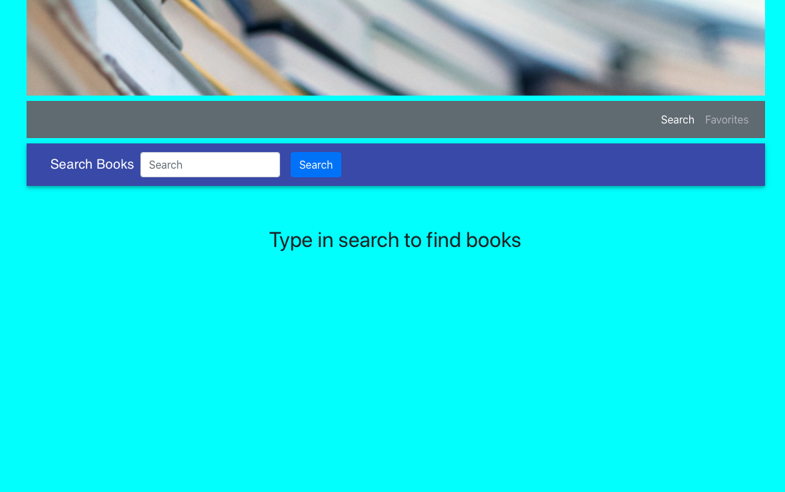
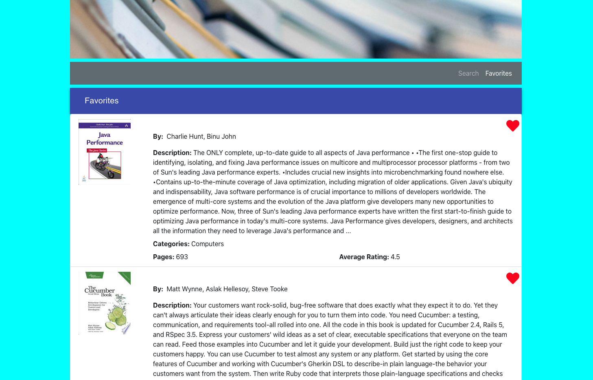
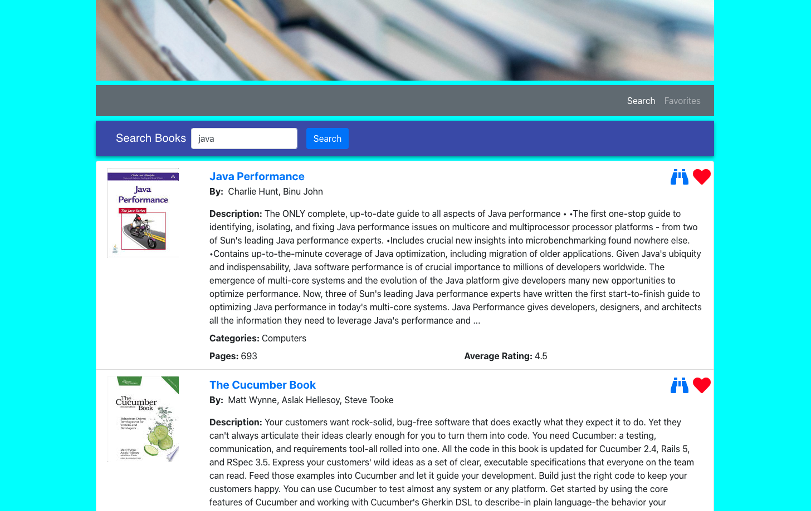

# Google Books Search

A React-based Google Books Search app. Users can search by the book title and would get a list, and are able to save their favorites. 

## Technologies used 

JavaScript, React, React-DOM, React-Scripts, Bootstrap, CSS, Google Books API, Axios, Express, MongoDB, Mongoose 

## Screenshots of the application

## Submission 

* The URL to the deployed application: https://fierce-beyond-40641.herokuapp.com

* The URL to the GitHub repository: https://github.com/betielbetu/Google-Books-Search
